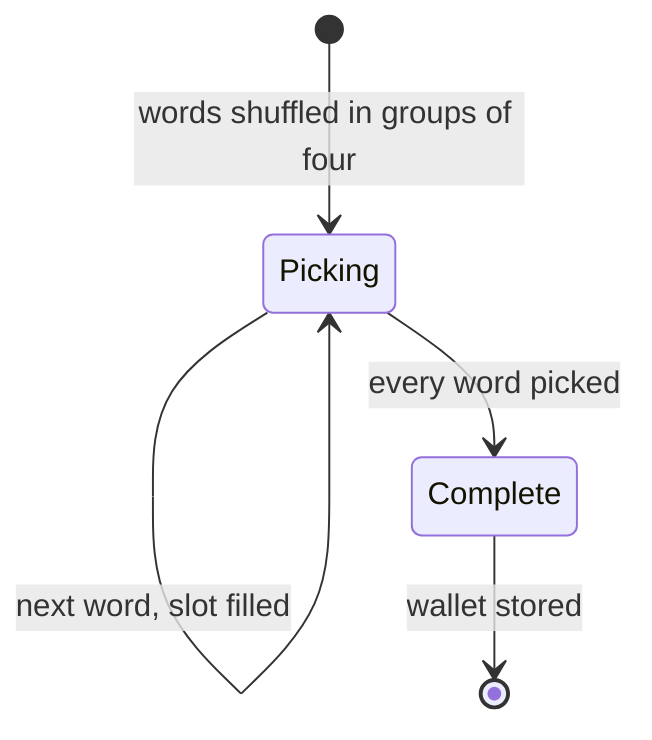
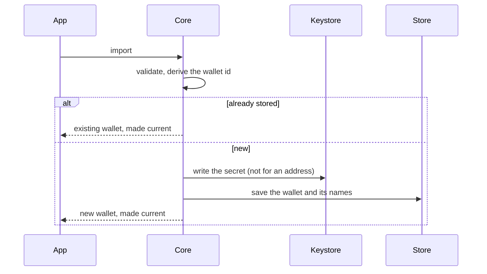
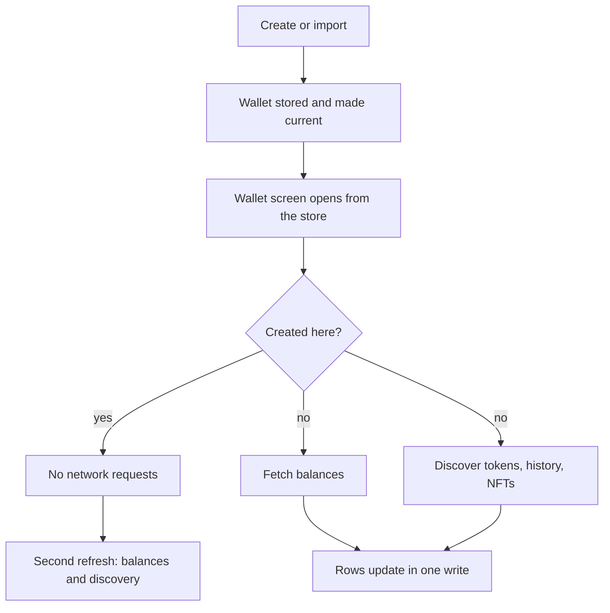
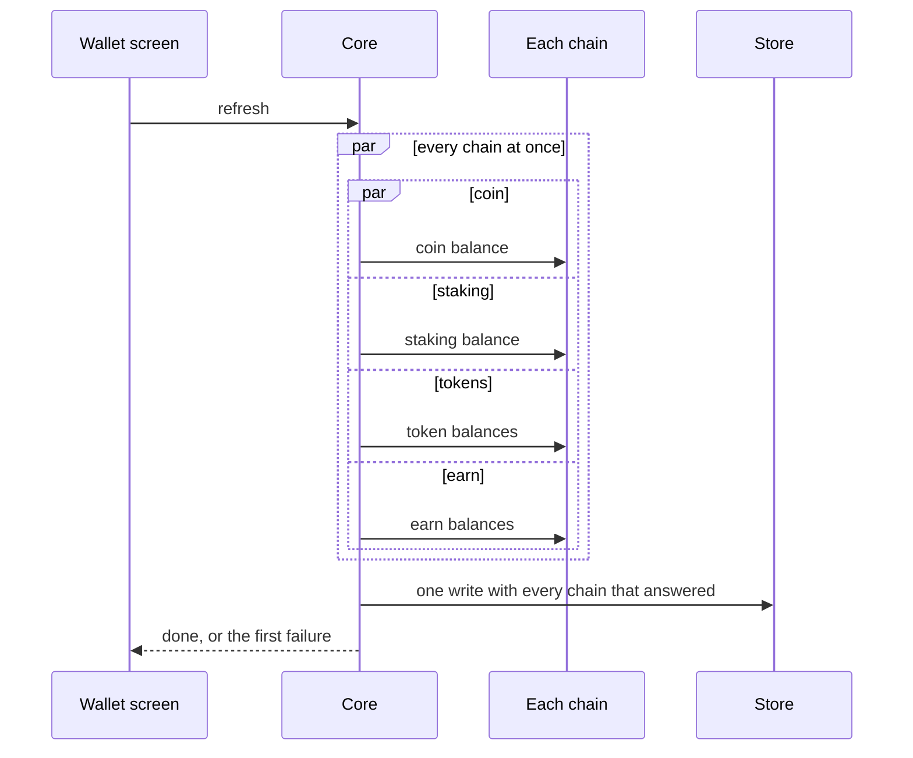

# Product behavior

This document says how the product is meant to behave, one section per area, in terms a user would recognize: what appears at once, what loads, what the wallet promises when something is slow or fails, and why. [ARCHITECTURE.md](ARCHITECTURE.md) says how the code is shaped; this file says what the code is for. When the two disagree, this file states the intent and [TODO.md](TODO.md) carries the work.

Read the section for an area before changing its owner. A change that would break a rule below is a product decision, not a simplification, and it goes to [Decisions to make](TODO.md#decisions-to-make) with the reason; it never lands as a cleanup. When a rule changes on purpose, change it here in the same commit.

Every section has the same parts:

- **What the user gets** is the intent, in UX terms.
- **How it behaves** is the mechanism, with a diagram when order or concurrency matters. A `par` block in a sequence diagram means the branches run at the same time and none waits for another.
- **Rules** are the invariants, each with its reason. Keep them true, or raise the change as a decision.
- **When something fails** says what the user sees and what is stored. A silent failure is only acceptable when a dated decision says so.
- **Platform differences** lists only intentional ones, with the reason. Anything else that differs is a bug.
- **Open questions** are places where the code, the two apps or this text disagree and nobody has decided yet. They are not permission to pick one; they are the list of decisions to make.

Sections written so far: [Principles](#principles), [Create wallet](#create-wallet), [Import wallet](#import-wallet), [After create and import](#after-create-and-import), [Wallet](#wallet) with [Balances](#balances). Add a section for an area when its behavior carries a "why" that the code alone does not show; keep it to what a user or a reviewer needs, and link the code map rather than restating it.

## Principles

Every section below inherits these four promises. A change that trades one of them for simpler code is a product decision, not an engineering choice.

**Secure.** A secret, a signature and a confirmation stay explicit and fail closed. The user always sees what they are about to sign, with the amount, recipient, chain and fee named, and nothing is signed or sent without that screen. Secret material never leaves the platform's secure storage and never reaches a log, a screenshot or a clipboard without the protection the platform offers. When security state is missing or unsupported, the wallet refuses rather than guesses. The rules are in [Security](../skills/security.md); the confirmation contract is in [ARCHITECTURE](ARCHITECTURE.md#3-return-one-record-that-answers-the-whole-question).

**Fast.** The user waits only for work that must happen in order. Anything already stored shows at once, and a refresh replaces it in place rather than blanking it. Independent requests start together and none of them waits for a slower sibling: balances per chain and per kind, chart and history and metadata on an asset, fee and simulation on confirm. A failed source keeps what was on screen and reports itself; it never hides the sources that answered. Budgets and how to measure them are in [Performance](PERFORMANCE.md); the concurrency rule is [Secure, fast, simple, powerful](ARCHITECTURE.md#secure-fast-simple-powerful).

**Native.** Each app looks and behaves like a first-class app of its platform: SwiftUI on iOS and Compose on Android, system navigation, system sheets, system share and paste, platform biometrics, the platform's number and date formatting in the user's locale, and the platform's accessibility. The product rules are shared in Core so both apps decide the same thing; how it is drawn is each platform's own. An intentional difference is listed in its section with the reason; any other difference is a bug.

**Smooth.** Scrolling, typing and transitions hold the display's frame rate, and the app never freezes or flickers. Heavy work (network, storage, decoding, transaction preparation, FFI calls that read a store) stays off the UI thread; views render prepared state; a price tick updates the rows it touches rather than rebuilding a list; late results for a wallet, asset or quote the user has left are dropped, not drawn. A reproducible hitch, a flash of empty content, or a screen that briefly shows another wallet's data is a defect to fix at its owner, not a polish item.

## Create wallet

**What the user gets.** On first launch, or from the wallets list, the user taps "Create a New Wallet", agrees to three terms once per install, reads three security reminders every time, sees a fresh 12-word phrase, proves they saved it by tapping the words back in order, and lands on the wallet screen with the new wallet current and named "Wallet #N". Nothing is written until the quick test passes; a wrong tap changes nothing and reveals nothing. The new wallet opens without a loading state and without a balance request, because a wallet created a moment ago has nothing on chain yet. The phrase stays on the device: copies expire, screenshots are detected or blocked, and no log ever prints it.

**How it behaves.** Core owner: [`GemWalletService`](../core/gemstone/src/services/wallet/mod.rs) with [`GemVerifyPhraseSession`](../core/gemstone/src/services/wallet/verify_phrase.rs). The entry is decided by the current wallet: iOS [`RootScene`](../ios/Gem/Scenes/RootScene.swift) shows the onboarding screen ("Welcome to Gem Family") whenever `currentWallet` is nil; Android [`getStartDestination`](../android/app/src/main/kotlin/com/gemwallet/android/ui/AppViewModel.kt) starts on onboarding when no wallet is current and none with accounts is stored. The wallets list offers the same two actions, as a sheet on iOS ([`WalletsNavigationStack`](../ios/Gem/Navigation/Wallets/WalletsNavigationStack.swift)) and as pushed routes on Android ([`WalletsScreen`](../android/features/wallets/presents/src/main/kotlin/com/gemwallet/android/features/wallets/presents/views/WalletsScreen.kt)).

The flow is terms, reminder, phrase, quick test, store. Terms: [`accept_terms_items`](../core/gemstone/src/services/onboarding.rs) lists self custody, recovery and responsibility; "Agree and Continue" enables when every item is ticked and the acceptance is stored once through [`set_accept_terms_completed`](../core/gemstone/src/services/preferences/mod.rs). Reminder: [`security_reminder_items`](../core/gemstone/src/services/onboarding.rs) shows "Store It Somewhere Safe", "Do Not Share It With Anyone" and "We Can't Help You Recover It" under "You will get a Secret Phrase", with Continue only. Phrase: [`create_wallet`](../core/gemstone/src/services/wallet/mod.rs) returns 12 English words from the OS random source, shown in two columns from [`secret_phrase_rows`](../core/gemstone/src/services/wallet/rules.rs) under "Save your Secret Phrase in a secure place that only you control." with a Copy button; iOS generates them when Continue is tapped on the reminder ([`navigate`](../ios/Features/Onboarding/Sources/Navigation/CreateWalletNavigationStack.swift)), Android when the screen opens ([`CreateWalletViewModel`](../android/features/create_wallet/viewmodels/src/main/kotlin/com/gemwallet/android/features/create_wallet/viewmodels/CreateWalletViewModel.kt)). Quick test ("Confirm"): the session shuffles the words inside groups of four, highlights the next empty slot and accepts only the chip carrying the next word. Store: the app calls [`import_wallet`](../core/gemstone/src/services/wallet/mod.rs) with kind phrase, no chain and source Create, so creation is the import path: a multicoin wallet over every chain, named by [`default_wallet_name`](../core/gemstone/src/services/wallet/mod.rs), marked as already synchronized, subscriptions invalidated, made current, all in one call (C53 in [docs/TODO.md](TODO.md)). Both roots observe the current wallet id, so the wallet tabs replace onboarding before the sheet closes; the per-wallet setup ([`setup_wallet`](../core/gemstone/src/services/app_start/mod.rs)) then runs and its failures are only logged.

**Rules.**

- MUST show all three terms and enable "Agree and Continue" only when every one is ticked, because a wallet is only created once the user has accepted self custody, no recovery and sole responsibility.
- MUST record the acceptance once per install and never ask again, because the terms bind the person, not the wallet.
- MUST show the security reminder on every create, in the order keep safe, do not share, no recovery, because the user must hear that the phrase is the only recovery path before seeing it.
- MUST generate 12 words from the OS random source, a new phrase on every visit, because the phrase is the only key and must never be predictable or reused.
- MUST lay the phrase out as two columns, first half left and second half right, an odd last word alone, because the printed number next to each word is the order the user must restore.
- MUST copy the phrase as a sensitive clipboard value that expires after one minute, because other apps read the clipboard.
- MUST shuffle the quick-test chips inside groups of four and never across a group, because the user should find each word near its position while still proving they hold the phrase.
- MUST accept only the unused chip that carries the next word, and NEVER change the session on a wrong word, a reused chip or an unknown index, because the test must not leak which word comes next.
- MUST enable Continue only when every word has been picked, because an unfinished test proves nothing.
- MUST store, name and activate the created wallet in one step, because a wallet that is stored but unnamed or not current is half created (C53).
- MUST name the wallet "Wallet #N" with N one above the highest stored index, and NEVER store a blank name, because every wallet row needs a label the user can tell apart.
- MUST mark a created wallet as already synchronized so the wallet screen shows no initial loading and asks no chain until its second refresh, because a wallet created a moment ago has nothing to discover.
- MUST create the shared keystore password only while the keystore holds no wallet, and NEVER ask the user to type one, because the password is an app secret the user never sees.
- MUST delete the secret it just wrote when the wallet record cannot be stored, because a retry must start clean and no orphan key may stay on disk.
- MUST save every account address as an internal address name and bump the subscriptions version, because the send flow labels own addresses and device subscriptions follow the wallet set (see [DEVICE_SUBSCRIPTIONS.md](DEVICE_SUBSCRIPTIONS.md)).
- NEVER print the phrase, the verify session or the import request in debug output, because logs leave the device.
- MUST detect a screenshot on the phrase, confirm and import screens and warn "Screenshots may be accessible to other apps, they can put your secret phrase at risk if saved this way.", because a photo of the phrase is a copy the app cannot expire.
- iOS MUST keep the Continue button busy while a successful create moves on, re-enable it with the error when the create fails, and re-enable it silently when the keystore prompt is cancelled, because a cancelled prompt is the user's choice, not a failure.
- iOS MUST ask for push permission when the create or import sheet closes, and only when the system has not decided yet and Core still allows an ask, because the first wallet is the moment notifications become useful.

**When something fails.**

| Step | What the user sees | What is stored |
| --- | --- | --- |
| Phrase generation fails | iOS: alert "An error occurred!" and the reminder stays; Android: the error text replaces the word grid | Nothing |
| Keystore prompt cancelled (iOS with biometric or passcode protection on the keystore) | Back on Confirm, button enabled, no alert | Nothing |
| Keystore write fails | iOS: alert "Create Wallet Error"; Android: see Open questions | Nothing |
| Wallet record write fails | Same as above; the keystore file just written is deleted | Nothing (retry works) |
| Per-wallet setup step fails after activation (assets, banners, balances, configuration) | The wallet screen shows anyway; nothing is said | The wallet; failures are logged only, by the app start contract that returns them for logging |
| Push permission denied | Nothing | iOS records nothing; Android records the ask and waits 30 days |

**Platform differences.**

- Android blocks screenshots and screen recording on the phrase, confirm and import screens with FLAG_SECURE; iOS cannot block, so it detects the screenshot and hides the content during recording ("Content hidden during screen recording"), because that is what each platform allows.
- Android keeps the system splash until the first wallet summary exists ([`launchReadyState`](../android/app/src/main/kotlin/com/gemwallet/android/ui/AppViewModel.kt)); iOS renders the tabs on the first frame the session has a wallet, because only Android has a system splash to hold.
- Android reads the keystore password with no per-read authentication; iOS may protect it with biometrics or passcode, so storing a further wallet on iOS can prompt Face ID, because each platform's secure store offers a different gate.
- On Android an uninstall wipes the password and keystore files, so reinstalling without the phrase loses the wallet; iOS Keychain items survive app removal (see [KEYSTORE_V4.md](KEYSTORE_V4.md), Security Invariants). Support guidance must never recommend reinstall.

**Open questions.**

- Should the terms gate every create and import, or only the onboarding screen? iOS checks `isAcceptTermsCompleted` at the root of every create and import sheet; Android's [`WalletApp`](../android/app/src/main/kotlin/com/gemwallet/android/ui/WalletApp.kt) checks it only from the onboarding screen and [`WalletNavGraph`](../android/app/src/main/kotlin/com/gemwallet/android/ui/navigation/WalletNavGraph.kt) routes the wallets list straight to the reminder or type picker. Options: Android checks like iOS, or a stored wallet counts as acceptance and iOS drops the check.
- What should a wrong tap in the quick test look like? Android shakes the chip and colors it red ([`WordChip`](../android/features/create_wallet/presents/src/main/kotlin/com/gemwallet/android/features/create_wallet/components/WordChip.kt)); iOS gives no feedback, the chip stays as it was. Options: both shake, or both stay silent.
- Where does Android show a create failure after the quick test? [`createWallet`](../android/features/create_wallet/viewmodels/src/main/kotlin/com/gemwallet/android/features/create_wallet/viewmodels/CreateWalletViewModel.kt) sets `dataError`, but only the phrase screen renders it, so on Confirm the loading dialog disappears with no message. Options: render the error on Confirm, or return to the phrase screen with the message.
- Should a stored name failure keep the wallet? [`store_import`](../core/gemstone/src/services/wallet/mod.rs) deletes the new keystore file when [`store_wallet`](../core/gemstone/src/services/wallet/mod.rs) fails, but that helper saves the address names after the wallet row, so a name-save failure would leave a wallet row without a key. Options: one transaction for both writes, or delete the row on that failure.
- Which rule recovers the current wallet at launch when the id is missing? Android picks the lowest index with accounts; iOS shows onboarding even with wallets stored; Core's `next_current_wallet` ranks multicoin first and is used only on delete (AUD57 in [docs/TODO.md](TODO.md)).
- When should the app ask for push permission? iOS asks when a root create or import sheet closes and never records the ask, so the 30-day re-ask never applies and the wallets-list sheets never ask; Android asks on the first session through [`switchPushEnabled`](../android/data/services/gemstone/src/main/kotlin/com/gemwallet/android/data/services/gemstone/device/DevicePushSettings.kt) and records it (D75 in [docs/TODO.md](TODO.md)).
- The quick test hard-codes groups of four on both apps and Android shows at most three groups on compact screens; only 12-word phrases are generated today, so is a 24-word phrase ever expected here (VM114 in [docs/TODO.md](TODO.md))?

## Import wallet

**What the user gets.** The user picks Multi-Coin or one network, then types, pastes or (on iOS) scans a secret phrase, a private key or an address, and gets a wallet that is validated, stored, named and current in one step. While typing a phrase, word suggestions follow the cursor and a tap completes the word; invalid input is refused with a message that names the problem, and nothing is written. Importing something already stored is not an error: a sheet names the existing wallet and continues into it. A watch wallet needs no key and warns up front that the user "cannot send or sell funds"; an address can be typed as a name and the resolved name becomes the wallet name.

**How it behaves.** Core owner: [`GemWalletService`](../core/gemstone/src/services/wallet/mod.rs) with [`GemWalletImportSession`](../core/gemstone/src/services/wallet/model.rs). The type picker ("Import Wallet") lists "Multi-Coin" first, then every chain by rank from [`get_chains`](../core/gemstone/src/services/chain/mod.rs) with a search field and an info link to the migration docs. [`import_screen`](../core/gemstone/src/services/wallet/rules.rs) then titles the screen "Multi-Coin" or the network name and decides the kinds: Multi-Coin offers only Phrase with no picker; a network offers Phrase, Private Key where [`supports_private_key_import`](../core/crates/signer/src/decode.rs) allows it, and Address, with a segmented picker. The session holds the text, the cursor and the importing flag; changing the kind clears it. The field placeholder is "Secret Phrase", "Private Key" or "Address or Name"; the keyboard has no autocorrect and no personalized learning. Phrase and private key input is protected: Paste clears the clipboard afterwards; an address is not. The Address kind resolves a typed name through the name service as the user types, and the view-only footer reads "You can view balances and transactions for this address, but cannot send or sell funds."

Import sends one request: kind, chain, raw input, the resolved name record if any, the default name from [`default_wallet_name`](../core/gemstone/src/services/wallet/mod.rs) and source Import. [`import_wallet`](../core/gemstone/src/services/wallet/mod.rs) builds the typed import, validates it, previews the wallet id and accounts without writing, returns an existing wallet of the same id and type untouched, otherwise reads or creates the shared password, writes the keystore file (never for an address), stores the wallet with its address names, bumps the subscriptions version, and makes the wallet current. An imported wallet is not marked synchronized, so the wallet screen shows its initial loading state until the assets discovery step completes and balances are fetched at once.

**Rules.**

- MUST offer only Phrase for Multi-Coin, and Phrase, Private Key and Address for a network, with Private Key only where the chain can decode one, because a private key has no meaning for a multicoin wallet and not every chain accepts one.
- MUST list Multi-Coin first and every chain by rank, narrowed by the search text, and show "No Results Found" for an unknown query, because the picker is the only way into a single-chain import.
- MUST suggest words only for a phrase, from the word at the cursor, at most 20, never the word already typed, and a picked suggestion MUST replace that word and move the cursor past a space, because the user edits inside the phrase, not only at its end.
- MUST clear the input when the kind changes, because a phrase must not linger in a private key field.
- MUST clear the clipboard after pasting a phrase or a private key and NEVER after pasting an address, because a secret must not stay pasteable elsewhere.
- MUST resolve a name only for the Address kind, because a phrase or a key is never a name.
- MUST prefer the resolved address and name, trimmed, and fall back to the typed input and the default name when they are blank, because the user typed a name to get its address.
- MUST lowercase a phrase and split it on any whitespace, refuse unknown words by naming them ("Invalid Secret Phrase word: %@") and refuse a failed checksum ("Invalid Secret Phrase"), because the user can fix a named word but not a vague error.
- MUST trim a private key and decode it for the chain ("Invalid private key"), and MUST trim, checksum and validate an address for the chain ("Invalid address or name"), because a wallet id derives from the value and a malformed one would store an unusable wallet.
- MUST require a chain for a private key or an address, because those values only mean something on one network.
- MUST treat a wallet with the same id and the same type as already imported, return it untouched with "This wallet has already been imported.", and NEVER treat the same secret imported as a different type as a duplicate, because a multicoin, a single-chain and a watch wallet over one address are different wallets.
- MUST store, name and activate the wallet in one call and refuse a blank name, because the import is not done until the wallet is usable (C53).
- MUST build a watch wallet without touching the keystore or the password, show it with the watch badge, and NEVER offer it a secret to export, because the user holds no key for it.
- MUST give a multicoin import every chain and add chains that later app versions introduce at launch, without unlocking the keystore for a wallet that misses nothing and without letting one unreadable keystore block the others, because a wallet imported last year must see this year's networks.
- The keystore password, orphan cleanup, address names, subscriptions and debug rules of Create wallet apply unchanged, because import and create share `store_import`.
- Android MUST color invalid phrase words while typing, because the user sees the mistake before tapping Import.

**When something fails.**

| Step or source | What the user sees | What is stored |
| --- | --- | --- |
| Paste with an empty clipboard | iOS: error haptic, field unchanged; Android: the field is emptied | Nothing |
| Unknown phrase word | "Invalid Secret Phrase word: x, y" | Nothing |
| Phrase checksum fails | "Invalid Secret Phrase" | Nothing |
| Private key does not decode for the chain | "Invalid private key" | Nothing |
| Address invalid for the chain | "Invalid address or name" | Nothing |
| Name resolution pending or failed at Import | The typed text is used as the address and validated as one | As validated |
| Same wallet already stored | Sheet titled with the wallet name, "This wallet has already been imported.", Continue enters it | Nothing new; the existing wallet becomes current |
| Keystore prompt cancelled (iOS) | Button re-enabled, no alert | Nothing |
| Keystore or wallet record write fails | iOS: alert "Validation Error"; Android: red text under the field, cleared on the next edit | Nothing; a new keystore file is deleted |
| Per-wallet setup after activation | Wallet screen shows with its loading state; failures logged only | The wallet |

**Platform differences.**

- iOS offers a Scan button for single-chain imports with a QR type per kind; Android has no scan on this screen. No reason is recorded (see Open questions).
- Android colors invalid phrase words inline; iOS relies on the error after Import. No reason is recorded (VM92).
- iOS shows import errors in an alert; Android shows them under the field and clears them on the next edit, because each follows its platform's form idiom.

**Open questions.**

- Should the paste transform live in the session? Android appends a trailing space after pasting a phrase and trims otherwise; iOS trims everything ([`onPaste`](../ios/Features/Onboarding/Sources/ViewModels/ImportWalletSceneViewModel.swift)). VM126 in [docs/TODO.md](TODO.md) proposes `on_pasted(text)` on the session; until then the two apps paste differently.
- Should iOS highlight invalid words while typing like Android, or should Android drop it? VM92 in [docs/TODO.md](TODO.md) leaves parity undecided.
- Should Android offer QR scanning for a single-chain import as iOS does, or is the iOS scanner intentional only there?
- When the import finds an existing wallet, Core already made it current before the sheet appears; on Android closing the sheet without Continue clears the input but the current wallet stays switched ([`ImportScreen`](../android/features/import_wallet/presents/src/main/kotlin/com/gemwallet/android/features/import_wallet/views/ImportScreen.kt)). Is switching on an existing import intended even when the user backs out?
- Is the Android empty-clipboard paste (an empty or single-space field, no feedback) intended, or should it match the iOS error haptic and leave the field alone?

## After create and import

Both flows end in the same place, the wallet screen, and differ only in what the network is asked for. A created wallet has no history, so nothing is fetched until the user has had a chance to fund it; an imported wallet has history, so balances and discovery start at once and run side by side.

### After a wallet is created

The new wallet becomes the current wallet at creation and the wallet screen opens on its default assets at zero. Nothing is fetched from any chain, because a phrase generated a moment ago has no history: [`setup_wallet`](../core/gemstone/src/services/app_start/mod.rs) ensures the default assets, sets up the wallet's banners (the onboarding welcome), adds the default balance rows for the wallet type and syncs the wallet configuration, and the balance setup of a created wallet that has never synced only rebuilds the price subscription so prices show at once. The first pull-to-refresh on that wallet stamps its discovery time and fetches nothing; from the second refresh on it behaves like any other wallet and runs the balance update and asset discovery together. Buy and Receive on the onboarding banner are the way in.

- NEVER ask a chain or run asset discovery for a wallet created in the app until its second refresh, because there is nothing to find and the request only delays the screen.
- MUST add every default row the wallet type gets, enabled or disabled, so the list is populated before any network answer.
- MUST show the onboarding banner only while every balance is zero.

### After a wallet is imported

The imported wallet is stored, named and made current in one call, and the wallet screen opens on its default rows at zero while the network is asked. Two things run at once and neither waits for the other: the balance setup fetches the balances of the enabled default assets straight away (coin, staking, tokens and earn as separate requests per chain, written as one batch; see [Balances](#balances)), and the first refresh of the wallet screen runs [asset discovery](../core/gemstone/src/services/asset_discovery/mod.rs) for the wallet's addresses, which enables every token the backend has seen for them (each enable fetches that token's balance), and loads the first page of transactions and the NFTs. A "Loading" row sits above the list until the assets step completes, so the user knows tokens may still appear. Every later refresh asks only for assets seen since the last discovery. A watch wallet (an address) goes through the same path and simply cannot sign.

- MUST fetch balances and run discovery concurrently on the first load, and MUST run discovery even when the balance update fails, because an outage on one chain must not stop the wallet's tokens from appearing.
- MUST keep the loading row until the first discovery completes and NEVER mark a discovery step complete after a failure, so the next refresh retries it.
- MUST discover only assets on the wallet's chains, once each, and never a token that mirrors a chain's native coin.

| Step | What the user sees | What is stored |
|---|---|---|
| The first balance fetch of an imported wallet fails | The default rows stay at zero with no error until the next pull; the failure is swallowed in `refresh_enabled_assets` (AUD59) | The rows and configuration; no balances |
| Discovery fails | The loading row stays; a pull retries | Balances that answered; the discovery time is not stamped |
| A discovered token's balance fetch fails | The token appears at zero until the next refresh | The token is enabled |

## Wallet

**What the user gets.** The wallet screen opens on what the store already holds: the wallet name, the total in the chosen currency with its 24h change, the header actions, the asset rows with balance, price and fiat value, and any banner. Nothing on screen waits for the network; a refresh runs behind the rows and changes only the rows whose values moved. The user can always switch wallet, scan, search, manage the token list, hide balances, pin or hide an asset, and pull to refresh. A slow or offline chain never hides a fast one, a failed refresh keeps what is on screen, and a response that lands after a wallet switch goes to the wallet it belongs to.

**How it behaves.** Both apps observe five store reads (the wallet, the enabled rows' fiat values, the perpetual collateral, the enabled asset rows, and the wallet-scope banners) and hand them to [`view_state`](../core/gemstone/src/services/wallet_home/mod.rs) on `GemWalletHomeService`, which answers the header, the actions, the visible banners and the perpetual and collection previews as one record (iOS [`homeState`](../ios/Features/WalletTab/Sources/ViewModels/WalletSceneViewModel.swift), Android [`GetWalletSummaryImpl`](../android/data/coordinators/src/main/kotlin/com/gemwallet/android/data/coordinators/asset/GetWalletSummaryImpl.kt)). The total is the sum over enabled rows of amount times price ([`total_fiat_value`](../core/crates/primitives/src/balance_calculator.rs)), plus the perpetual collateral (available plus reserved, at its price, no day change) when the wallet is in the standard perpetual account mode; the header reads the total as it is, even negative, and shows the change only when the total is positive and moved ([`total_header`](../core/gemstone/src/services/balance/rules.rs), `shows_pnl`). Rows come from the native query already ordered pinned first, then fiat value, then rank (iOS [`enabledBalance`](../ios/Packages/Store/Sources/Requests/AssetsRequest.swift), Android [`getAssetsInfo`](../android/data/services/store/src/main/kotlin/com/gemwallet/android/data/service/store/database/AssetsDao.kt)); [`asset_sections`](../core/gemstone/src/services/assets/rules.rs) splits them into a pinned section and the rest, with the popular section off on this screen. Hidden assets are simply not enabled rows, so they are not in the list. Each row is [`asset_list_row`](../core/gemstone/src/services/assets/rules.rs) drawn in `wallet_asset_row_style`: a native coin is titled by its chain with no symbol, the price and 24h change sit under the name, the total balance and its fiat value on the right, greyed when the balance is empty and with no fiat when the asset has no price. Balance privacy is the Core preference [`is_hide_balance_enabled`](../core/gemstone/src/services/preferences/mod.rs), toggled from the header on both apps and from Settings ("Hide Balance"); it masks the header, the rows and the perpetual preview.

Pull-to-refresh calls [`refresh`](../core/gemstone/src/services/wallet_home/mod.rs): a wallet created moments ago only stamps its discovery time, because it has nothing to fetch; every other wallet runs the balance update of its enabled assets and asset discovery (new tokens, then the first-load transactions and NFTs) concurrently, and the first failure is returned after both branches finish. Prices are not part of a pull. They arrive only over the device socket: `subscribePrices` on each connection returns the current prices and rates, later ticks are batched ([Device WebSockets](DEVICE_WEBSOCKETS.md)), and there is intentionally no interval timer on this screen ([intentional differences](ARCHITECTURE.md#intentional-platform-differences-and-compatibility)). Price and rate events are applied in order inside [`decode_event`](../core/gemstone/src/services/stream/mod.rs); a socket `balances` or `transactions` event runs the same balance update for the named assets through `sync`, which both apps start outside the socket loop so a replayed backlog never delays the price snapshot. Until the first asset discovery of a wallet completes, a "Loading" row sits above the list ([`shows_initial_loading`](../core/gemstone/src/services/wallet_home/rules.rs)). Switching wallets resets navigation, runs [`setup_wallet`](../core/gemstone/src/services/app_start/mod.rs) for the new wallet (default rows, banners, configuration), rebuilds the price subscription from its enabled assets ([`prepare_session`](../core/gemstone/src/services/stream/subscription.rs)) and reruns the first load; iOS builds a fresh scene per wallet ([`onChangeWalletId`](../ios/Gem/ViewModels/RootSceneViewModel.swift)), Android cancels the previous wallet's load and scrolls to the top ([`AppViewModel`](../android/app/src/main/kotlin/com/gemwallet/android/ui/AppViewModel.kt), [`AssetsViewModel`](../android/features/assets/viewmodels/src/main/kotlin/com/gemwallet/android/features/assets/viewmodels/AssetsViewModel.kt)).

The banners this screen can show are the events no asset owns ([`visible_banners`](../core/gemstone/src/services/banner/rules.rs)): the externally controlled account warning ("This %@ account can be controlled by someone else. Do not send funds to it unless you are certain you control it, or you may permanently lose your assets."), which is always active, cannot be closed and disables the header buttons while it is visible; and the onboarding welcome ("Your wallet is ready", "Buy or Receive crypto to get started", with Buy and Receive buttons), which exists only for a wallet created in the app and shows only while every balance is zero. Always-active banners sort first, then by event priority. Closing a banner stores Cancelled ([`close`](../core/gemstone/src/services/banner/mod.rs)) and it never returns. iOS shows the first visible banner, Android pages through all of them; which is right is open (D74).

There is no separate empty view. A new wallet shows its default assets at zero ([`default_balances`](../core/gemstone/src/services/assets/rules.rs): the native coin of every account chain plus each chain's default tokens, enabled or disabled per wallet type), a zero total without PnL, the onboarding banner if it was created here, and the "Manage Tokens" footer. A watch wallet shows "Watch-only wallet. You don't control these funds." in place of the buttons. The perpetuals preview appears only when the perpetual flag is on, the wallet is multicoin and holds a Hyperliquid-family chain ([`show_perpetuals`](../core/gemstone/src/services/perpetual/rules.rs)); it lists the open positions, or a "Trade Perpetuals" row with the collateral total when there are none. The collections preview follows [`show_collections`](../core/gemstone/src/services/wallet/rules.rs).

**Rules.**

- MUST compute the header from the enabled rows the store holds and show the change only when the wallet holds value and moved, because an empty wallet has no change to show.
- MUST count perpetual collateral as available plus reserved at its price with no day change, and only in the standard account mode, because what positions hold is still the user's money.
- MUST offer Send, Receive and Buy to every signing wallet and Swap only to a multicoin wallet or a single-chain wallet whose chain swaps; a watch wallet gets no buttons, because it cannot sign.
- MUST disable the header buttons while the externally controlled account warning is on screen, because sending from an account someone else controls can lose the funds.
- MUST show the onboarding banner only for a wallet created in the app and only while every balance is zero, because an imported wallet already knows how to fund itself.
- MUST show on the wallet screen only the banners no asset owns, always-active first, then by event priority.
- NEVER show a closed banner again and NEVER offer close on an always-active warning, because a warning about the account itself must stay visible.
- MUST put pinned assets in their own section above the rest and keep the popular section off on the wallet screen, because pinning is the user's own order.
- MUST title a native row by its chain, hide the symbol, show the price under it and the total balance with its fiat on the right, greyed when empty.
- MUST run the balance update and asset discovery concurrently on refresh and run discovery even when balances fail, because a chain outage must not stop new tokens from appearing.
- NEVER ask the network on a just-created wallet's first refresh, because it has nothing to discover.
- MUST show the loading row until the first asset discovery completes and NEVER mark a discovery step complete after a failed refresh, because an imported wallet's tokens are still unknown until then.
- NEVER run an interval refresh on the wallet screen; prices come from the socket and everything else from a pull, a foreground reconnect or a socket event, because polling duplicates what the socket already delivers ([intentional differences](ARCHITECTURE.md#intentional-platform-differences-and-compatibility)).
- MUST rebuild the price subscription from the new wallet's enabled assets on a switch and drop the previous wallet's extra requests.
- MUST keep what is on screen when a refresh fails ([load state contract](ARCHITECTURE.md#a-screens-load-state-is-one-core-state-and-a-failed-refresh-keeps-what-is-shown)); both apps only log the failure (iOS `updateWallet`, Android `onRefresh`).

**When something fails.**

| Step or source | What the user sees | What is stored |
|---|---|---|
| Balance update fails on every chain | Rows and total unchanged; no error UI, the failure is logged on both apps | Nothing for balances; discovery still runs and records what it found |
| Asset discovery fails | Rows unchanged; on a first load the "Loading" row stays | Balances that answered are written; the discovery steps stay incomplete so the next refresh retries |
| Socket down or reconnecting | Prices and the 24h change stay as last stored; the connection banner says "Balances and activity may be outdated." | Nothing; the reconnect resubscribes and the `subscribePrices` snapshot re-prices every enabled asset |
| Banner close fails | An error toast on both apps | Banner state unchanged |
| A wallet setup step fails on a switch | The screen still opens from the store; the step is logged | The steps that succeeded stay applied |
| Created wallet's first pull | Only the pull indicator; nothing is fetched by design | The discovery timestamp is stamped so the next pull fetches |

**Platform differences.**

- Android draws the Play in-app update banner as a row of the wallet list; iOS asks with an alert at launch, because the store delivery channel differs (`AppUpdateCoordinator` in the [service map](ARCHITECTURE.md#screen-services)).

**Open questions.**

- Does a pull refresh prices? `refresh` joins balances and discovery only; prices arrive solely from the socket. If the socket is down a pull leaves stale prices with no request. Options: keep socket-only and say so in this doc; or have `refresh` send `getPrices` for the enabled assets when the connection is down.
- How many banners does the wallet screen show? iOS renders only the first visible banner, Android pages through every one, and Core hands back the whole ordered list (D74). Options: Core returns one row; or Core says how many and both apps draw the same count.
- Is a silent failed refresh intended? Both apps log a failed pull and show nothing; the only user-visible signal is the connection banner when the device is offline. A chain outage while online shows nothing. Options: keep silent (the contract says a failed refresh keeps what is shown); or surface the first failure as a toast after the pull settles.

### Balances

**What the user gets.** A refresh asks every chain of the wallet at once, and on each chain asks for the coin balance, the staking balance, the token balances and the earn balances as separate requests, because the coin answers fastest and a slow or failing source must not hold back the others (today a failed component still discards its chain's other answers; see Open questions). What answered is written in one atomic batch, rows that did not change are not touched, a chain that failed keeps its previous values on screen, and a late response never overwrites a newer one. A new wallet gets its default rows immediately, an imported wallet fetches them at setup, and enabling or discovering a token creates its row and fetches its balance.

**How it behaves.** [`update`](../core/gemstone/src/services/balance/mod.rs) on `GemBalanceService` owns the refresh. It takes a sequence number, builds one request per account chain that has an enabled asset (`balance_requests`: the coin when a native id is present, the token ids by their typed chain), and runs every chain concurrently. Inside a chain, `chain_balances` runs the four component requests concurrently and then joins them with `?` on each, so one failed component turns the whole chain into a failure (see Open questions). `published_balances` keeps every chain that answered and remembers the first error in request order. If anything answered, `write_balances` takes that wallet's publication lane (`wallet_publication`), drops updates already superseded for the same asset and kind (`newer_updates`), reads the stored rows, creates the rows the store lacks for assets it knows (disabled), folds the updates by kind onto the stored rows and keeps only the rows that differ (`changed_balances`), converts with each asset's decimals (`balance_records`) and writes them in one store call, which both adapters commit in one transaction ([batch contract](ARCHITECTURE.md#publish-a-multi-source-refresh-as-one-batch), [atomic changes](ARCHITECTURE.md#atomic-changes-concurrent-publication-and-query-contracts)). The first failure is returned after the write. Other wallets and the price lane stay concurrent. Socket `balances` and `transactions` events reach the same `update` for the named assets.

Setup ([`setup_wallet`](../core/gemstone/src/services/balance/mod.rs)) adds the default enabled and disabled rows a wallet lacks; a wallet created in the app with nothing synced only resubscribes prices, every other wallet fetches its enabled defaults. Enabling ([`set_assets_enabled`](../core/gemstone/src/services/balance/mod.rs)) dedupes the ids, drops native mirror tokens, fetches unknown assets from the API, creates missing rows, writes one configuration patch (disabling also unpins) and then fetches the newly enabled balances; disabling only rebuilds the price subscription. Discovery ([`sync_assets`](../core/gemstone/src/services/asset_discovery/mod.rs)) asks the API for assets seen since the wallet's last discovery time, keeps the ones on the wallet's chains, enables them through the same path, then stamps the time and marks the step complete. A balance carries `available`, `frozen`, `locked`, `staked`, `pending`, `pending_unconfirmed`, `rewards`, `reserved`, `withdrawable`, `earn` and optional metadata (Tron votes, energy and bandwidth); a coin answer writes available, frozen, reserved and pending unconfirmed, a stake answer writes staked, pending, rewards, locked and frozen and keeps the previous metadata when it carries none, a token answer writes available, an earn answer writes earn. The row total ([`total`](../core/gemstone/src/services/balance/model.rs)) is available plus frozen, locked, staked, pending, rewards and earn; reserved and pending unconfirmed are shown as their own rows on the asset screen, and energy and bandwidth read "available / total" ([`balance_resource_rows`](../core/gemstone/src/services/balance/rules.rs)). Prices are stored in USD and in the current currency, converted once at write with the stored rate ([`update_prices`](../core/gemstone/src/services/price/mod.rs), [`fiat_prices`](../core/gemstone/src/services/price/rules.rs)); only moved prices are saved, a currency switch reconverts the stored prices, and the row multiplies its total by the stored currency price, so no app converts anything.

**Rules.**

- MUST ask the coin, staking, token and earn balances of a chain as separate concurrent requests, because the coin answers faster and a slow or failing source must not hold back the others (AUD39 in the [ledger](TODO.md#ledger-of-closed-sections)); a shared per-chain snapshot is not a simplification.
- MUST publish every chain that answered in one atomic write and return the first failure after the write, because a chain outage must not discard good data or mix two refreshes.
- MUST write only rows whose values differ, folding each answer onto its own fields, because a stake answer must not clear a coin's available balance and unchanged rows must not wake observers.
- NEVER let a response that arrives after a newer one overwrite it for the same asset and kind, and MUST let a concurrent coin and stake write of one asset keep each other.
- MUST key every write by the wallet the refresh was asked for, because a response that lands after a switch belongs to its own wallet ([batch contract](ARCHITECTURE.md#publish-a-multi-source-refresh-as-one-batch)).
- MUST convert each value with the asset's decimals and skip assets the store does not know.
- MUST create only the rows a response names and the store lacks, disabled.
- MUST give a wallet its default rows at setup, only the ones it lacks, enabled or disabled by wallet type, and NEVER ask the chains for a wallet created a moment ago.
- MUST hide and unpin in one configuration patch, because separate writes would let an observer see a hidden pinned row.
- NEVER enable or discover a token that mirrors the chain's native coin.
- MUST discover only assets on the wallet's chains, once each, and request tokens by their typed chain.
- MUST keep the last stake metadata when a stake answer carries none, because Tron resources are not part of every answer.
- MUST read a Tron resource as available over total.
- MUST store prices in USD and apply the currency rate once at write, save only moved prices, and commit a refresh that started before a currency switch in the new currency.
- MUST rebuild the price subscription from the stored enabled assets after a setup, an enable or a disable, without a REST price call.

**When something fails.**

| Step or source | What the user sees | What is stored |
|---|---|---|
| One chain fails | The other chains' rows update; the failed chain keeps its previous values and the total counts them, never an unknown state | One batch of the chains that answered; the first error is returned after the write |
| One component fails while the others on that chain answered (say staking while the coin answered) | Nothing on that chain changes | Nothing for that chain: `chain_balances` joins with `?`, so the coin answer is discarded (open question below) |
| The store does not know an asset the chain named | No row | Skipped by `balance_records` |
| A response older than one already published for the same asset and kind | The newer value stays | Dropped by `newer_updates` |
| The store write fails | Rows unchanged; the caller gets the error (the wallet screen logs it) | Nothing: one transaction |
| The wallet is missing from the session store | Nothing | Nothing; `update` returns Ok silently (open question below) |
| The first fetch after enabling or discovering an asset fails | The new row sits at zero until the next refresh; the enable itself succeeded | Row and configuration written; the fetch error is swallowed in `refresh_enabled_assets` (AUD59, open) |
| A price arrives in a non-USD currency with no stored rate | The price stays | Dropped until a rate exists; USD needs no rate. |

**Platform differences.**

- None. Both store adapters commit the batch in one transaction and both apps observe the same rows; iOS still re-derives balance and fiat outside the wallet list (VM5), which is a migration, not a difference in behavior.

**Open questions.**

- A failed component fails its whole chain today. The stated intent, and the AUD39 ledger entry, say coin, token and staking are separate calls so that one component's failure or latency cannot hold back the others; but `chain_balances` joins its four results with `?`, so a failed staking or earn request discards the coin and token answers that succeeded on that chain, and no test covers the case. Options: publish the components that answered and return the first component failure (extend `published_balances` to per-component results, add the test); or keep chain-level all-or-nothing, record it in the ledger and add a test that pins it.
- "As soon as possible" versus one batch. `update` waits for every chain (`join_all`) and every component (`join!`) before its single write, so the fastest chain's coin balance is published only when the slowest chain or component has answered or failed; the ARCHITECTURE batch contract chooses this on purpose ("Per-source publication would increase observer notifications and mixed-age totals") and asks the owner to define and test any replacement. Options: keep one batch and state that "separate calls" means fetched concurrently and published together; publish per chain as each chain completes (each write still atomic and lane-ordered), accepting more observer notifications; or publish in two stages, coin and tokens first, staking and earn when they arrive.
- The first fetch after enabling or discovering an asset swallows its error, so a just-enabled token sits at zero with no signal until a refresh (AUD59, needs a decision).
- `update` returns Ok silently when the wallet is not in the session store. Options: keep it (a wallet deleted mid-refresh has nothing to show); or return a store error so the caller can log it.
- Within one asset, the coin answer and the stake answer both write `frozen`, so whichever lands later wins for that field. Options: confirm one owner per field; or record which chains report frozen through each source and why both must write it.
